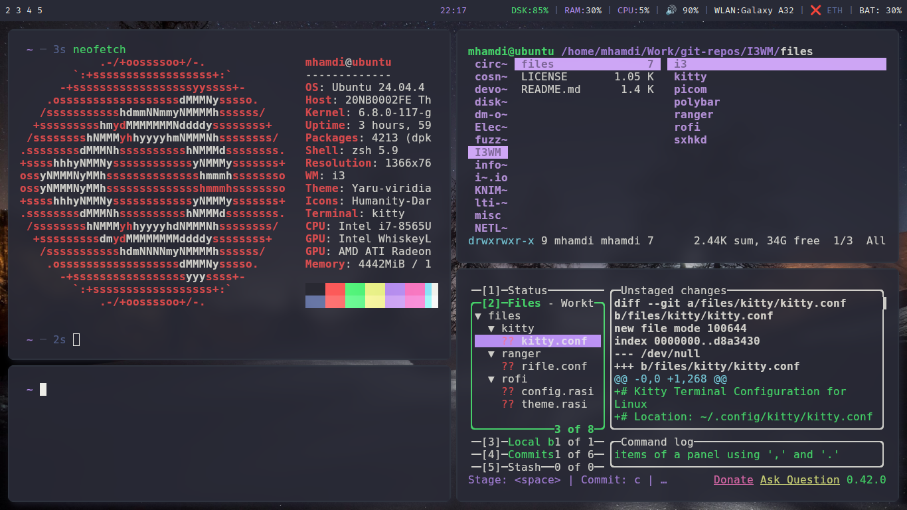

# dotfiles - i3wm setup

A minimal, keyboard-driven desktop environment, built around `i3wm` with a Dracula color scheme.
 
 
 
## Installation
 
**Clone the repository**:
```bash
git clone git@gtihub.com:a-mhamdi/i3wm
cd i3wm
```

**Dependencies**
```bash
sudo apt install i3 picom polybar rofi sxhkd \
  fonts-firacode fonts-noto-color-emoji
```
 
For Nerd Font icons in `polybar`, install FiraCode Nerd Font manually:
 
```bash
mkdir -p ~/.local/share/fonts && cd ~/.local/share/fonts
wget https://github.com/ryanoasis/nerd-fonts/releases/latest/download/FiraCode.zip
unzip FiraCode.zip && fc-cache -fv
```

## Components
 
| Tool | Role |
|------|------|
| [i3wm](https://i3wm.org/) | Tiling window manager |
| [picom](https://github.com/yshui/picom) | Compositor (transparency & shadows) |
| [polybar](https://github.com/polybar/polybar) | Status bar |
| [rofi](https://github.com/davatorium/rofi) | App launcher & window switcher |
| [sxhkd](https://github.com/baskerville/sxhkd) | Hotkey daemon |
 
## Structure
 
```
~/.config/
├── i3/
│   └── config
├── picom/
│   └── picom.conf
├── polybar/
│   ├── config.ini
│   └── launch.sh
├── rofi/
│   └── config.rasi
└── sxhkd/
    └── sxhkdrc
```
 
## Polybar
 
`Polybar` is launched via `launch.sh`, called from `i3` config:
 
```
exec_always --no-startup-id ~/.config/polybar/launch.sh
```
 
The script kills any existing instance before relaunching, and supports multi-monitor setups via `xrandr`.
